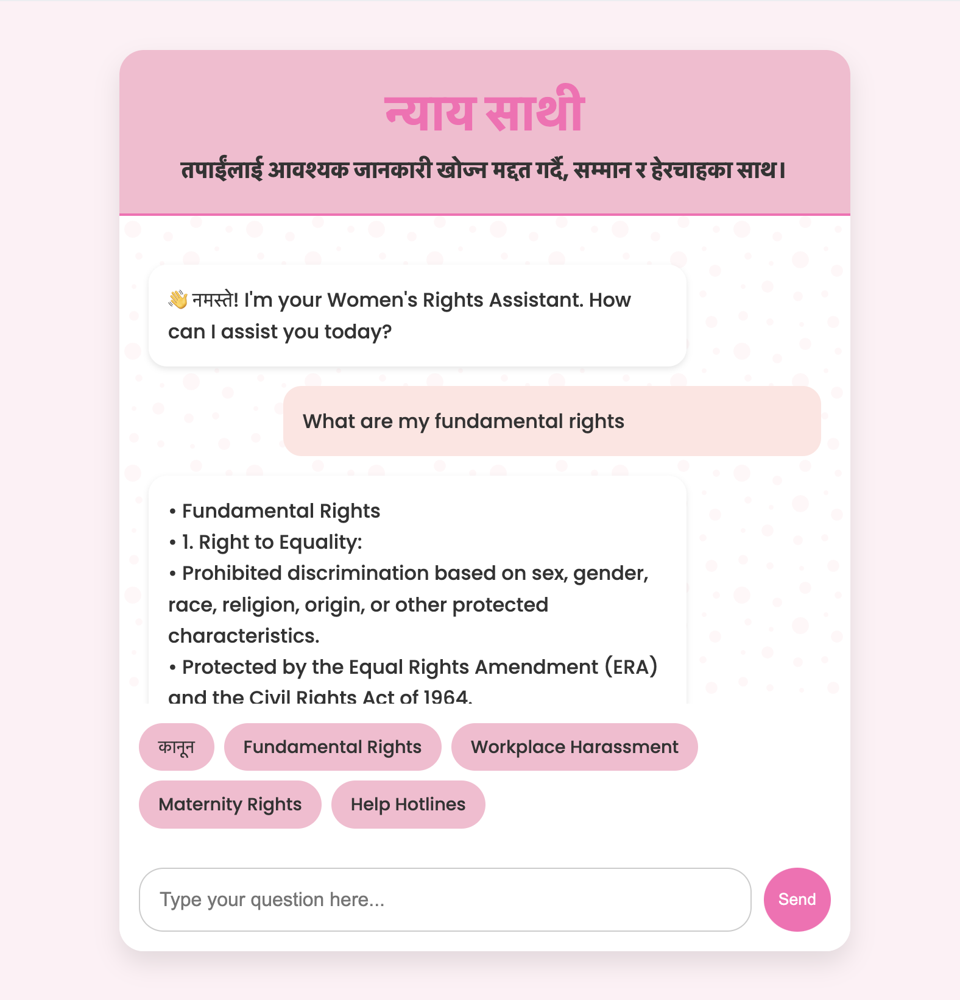

# Nyaya-Sathi 🤖💜

**Nyaya-Sathi** (Justice Companion) is a friendly AI-powered chatbot designed to help women and girls by providing easy access to information on their rights, safety, healthcare, and empowerment. This project is built with a goal to support gender equality and make valuable information available to those who need it.

---

## Why I Built This 💡
In many parts of the world, women and girls don’t always know their rights or have easy access to information that could protect them. Nyaya-Sathi was built to help change that. With this chatbot, women can ask questions about their rights and get quick answers, making it easier to understand and stand up for themselves.

## Features 
- **Smart Answers**: Uses AI to provide clear, helpful answers to questions about gender rights and safety.
- **Quick Suggestions**: Offers suggested questions to help users get started.
- **Language Options**: Includes local languages for broader reach.
- **Private Access**: No login needed to use the chatbot, ensuring privacy.

## Tech Stack 🛠️
- **Frontend**: HTML, CSS, JavaScript
- **Backend**: FastAPI, Gemini API for AI responses
- **Authentication**: Auth0 for secure access control

## Demo

 

Nyaya-Sathi demo [here](https://youtu.be/3A5j5mu-sAM)

## How Nyaya-Sathi Supports Gender Equality 🌍
Nyaya-Sathi contributes to gender equality by making information on women’s rights and safety accessible. This aligns with the UN Sustainable Development Goal 5 (Gender Equality). By providing this AI-powered support, Nyaya-Sathi empowers women and girls to understand and assert their rights, helping create a more equal world.

## Setup Instructions ⚙️
To get Nyaya-Sathi up and running, follow these steps:

1. Clone this repository:
   ```bash
   git clone https://github.com/your-username/Nyaya-Sathi.git
   cd Nyaya-Sathi
2. Install required dependencies:
   ```bash
    pip install -r requirements.txt
3. Start the FastAPI server:
    ```bash
    uvicorn main:app --reload
4. Open index.html in your browser to access the chatbot interface.

## How to Use Nyaya-Sathi 🚨
1. Log In: Use the login button to securely access the chatbot.
2. Ask Questions: Type your questions in the input box, or click a suggested question to learn more about your rights.
3. See Answers: Receive AI-powered answers on gender rights, healthcare, safety, and more.

## Future Improvements 🔮
1. More Languages: Add support for additional languages.
2. Expanded Knowledge: Continuously update with more information.
3. Voice Feature: Include a voice option to make it even easier to use.

